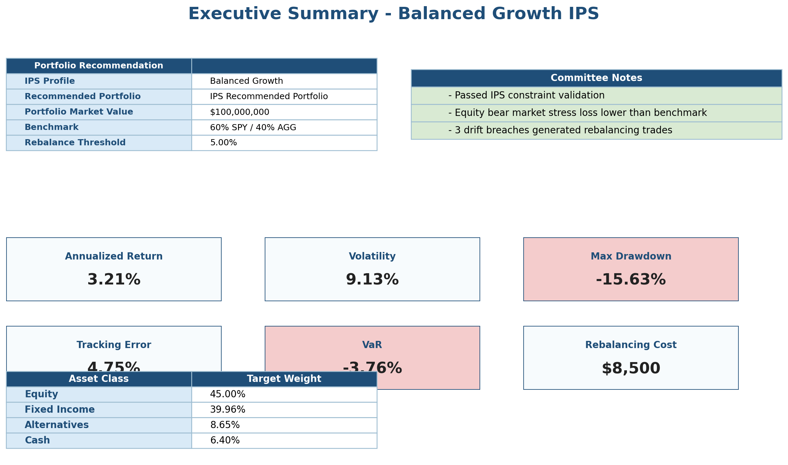
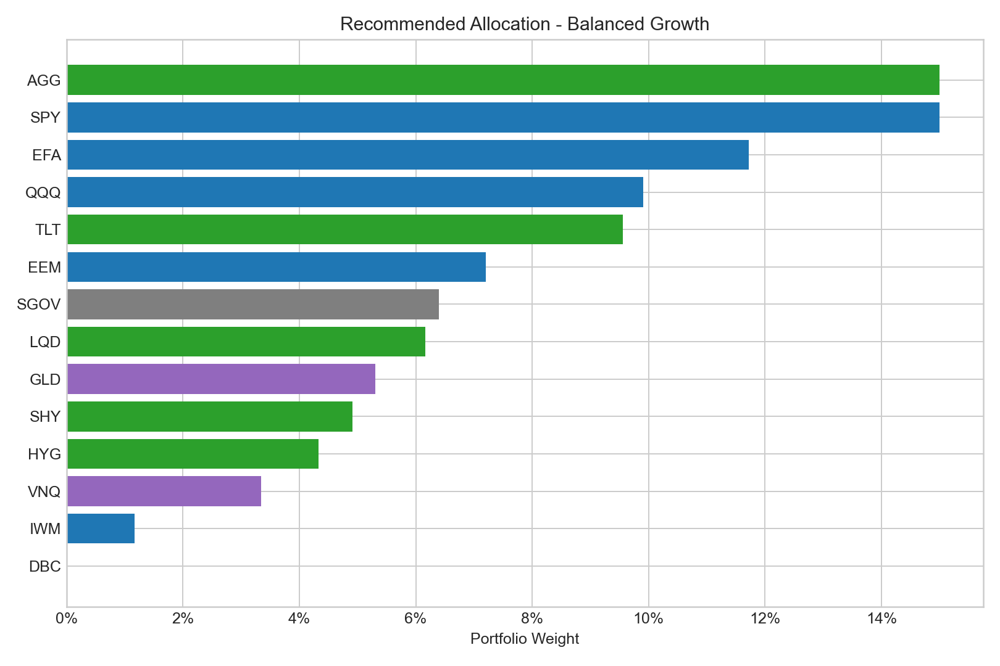
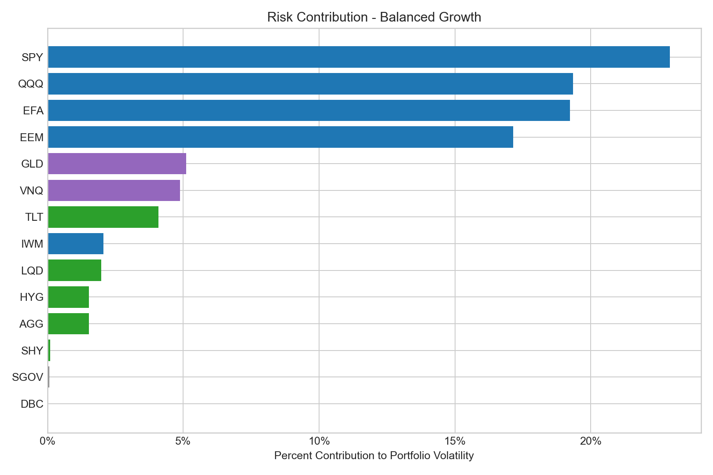
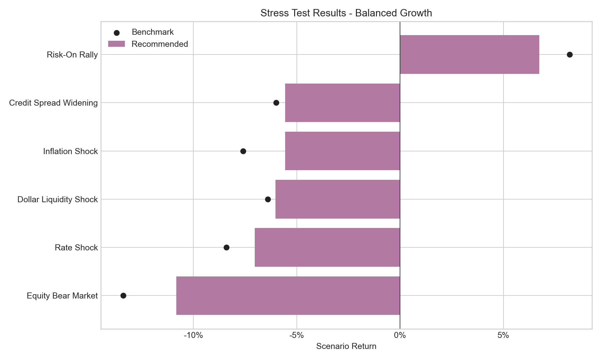
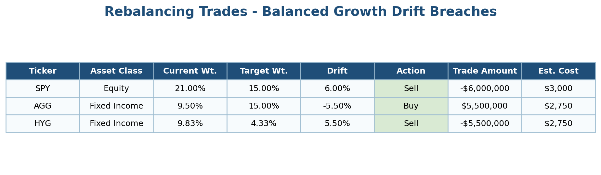

# IPS-Driven Multi-Asset Allocation & Rebalancing Engine

This project simulates an institutional investment management workflow for building, monitoring, and rebalancing a multi-asset ETF portfolio.

The engine converts an Investment Policy Statement (IPS) profile into portfolio constraints, constructs a recommended allocation, validates policy limits, compares the portfolio against a benchmark, analyzes risk contribution, runs stress tests, monitors drift, generates rebalancing trades, and produces an investment committee-style Excel report and memo.

The project is educational and does not represent financial advice, a live investment recommendation, or production investment management software.

## Screenshots

### Executive Summary



### Recommended Allocation



### Risk Contribution



### Stress Test Results



### Rebalancing Trades



## What This Project Does

- Builds a Balanced Growth portfolio using IPS constraints
- Allocates across equity, fixed income, alternatives, and cash
- Validates allocation rules such as max ETF weight, SPY/AGG anchors, HYG cap, and asset-class ranges
- Calculates return, volatility, Sharpe ratio, Sortino ratio, drawdown, tracking error, information ratio, VaR, and CVaR
- Compares the portfolio against a 60/40 SPY/AGG benchmark
- Estimates ETF-level risk contribution using the covariance matrix
- Runs full-portfolio and equity-sleeve factor diagnostics
- Stress-tests the allocation under equity bear market, rate shock, inflation shock, credit-spread widening, and risk-on scenarios
- Monitors policy drift and generates rebalancing trade recommendations
- Produces an Excel investment committee report and investment memo

## Selected Results

The final Balanced Growth model allocation is:

- Equity: 45.0%
- Fixed Income: 40.0%
- Alternatives: 8.6%
- Cash: 6.4%

Key portfolio metrics:

- Annualized return: 3.21%
- Annualized volatility: 9.13%
- Max drawdown: -15.63%
- Tracking error vs benchmark: 4.75%
- 95% historical VaR: -3.76%
- 95% historical CVaR: -5.04%

Risk contribution analysis identifies SPY, QQQ, and EFA as the largest estimated contributors to portfolio volatility. The rebalancing engine identifies 3 drift breaches and generates trade actions for SPY, AGG, and HYG.

## Investment Workflow

The project follows a portfolio analyst workflow:

1. Create synthetic IPS profiles.
2. Fetch public ETF data where available, with deterministic fallback data for reproducible offline runs.
3. Convert daily prices to month-end ETF returns.
4. Build IPS benchmark returns.
5. Construct constrained portfolio candidates.
6. Select an IPS Recommended Portfolio.
7. Validate IPS constraints.
8. Calculate risk and return metrics.
9. Estimate risk contribution from the covariance matrix.
10. Run full-portfolio and equity-sleeve factor diagnostics.
11. Apply market stress scenarios.
12. Generate rebalancing trades from synthetic drifted current weights.
13. Produce charts, CSV outputs, an Excel report, and a committee memo.

## ETF Universe

The allocation universe includes:

- SPY, QQQ, IWM, EFA, EEM for equity exposure
- AGG, TLT, SHY, LQD, HYG for fixed income and credit exposure
- VNQ, GLD, DBC for alternatives and real assets
- SGOV as a cash / T-bill proxy

## Methodology

Portfolio construction uses `scipy.optimize` with no shorting, full-investment constraints, IPS asset-class ranges, ETF-level minimums and caps, and concentration penalties.

The recommended allocation is not positioned as an attempt to beat a benchmark. It is positioned as an IPS-driven allocation that balances policy fit, diversification, downside awareness, benchmark tracking, and governance.

## Outputs

Key output files:

- `output/investment_committee_report.xlsx`
- `output/investment_memo.md`
- `output/recommended_allocation.csv`
- `output/portfolio_risk_summary.csv`
- `output/risk_contribution_summary.csv`
- `output/stress_test_results.csv`
- `output/rebalancing_trades.csv`
- `output/constraints_validation.csv`

Key charts:

- `charts/recommended_allocation.png`
- `charts/cumulative_performance_vs_benchmark.png`
- `charts/drawdown_comparison.png`
- `charts/risk_contribution.png`
- `charts/stress_test_results.png`
- `charts/policy_drift.png`

## How to Run

Install dependencies:

```bash
pip install -r requirements.txt
```

Run the full pipeline:

```bash
python main.py
```

Run tests:

```bash
pytest -q
```

## Project Structure

```text
ips-driven-asset-allocation-engine/
├── README.md
├── requirements.txt
├── main.py
├── src/
├── tests/
├── data/
│   ├── raw/
│   └── processed/
├── output/
├── charts/
└── docs/
    └── screenshots/
```

## Data Disclaimer

The project uses public ETF price data where available and deterministic synthetic fallback data when downloads fail. IPS profiles are synthetic because real client IPS data is private.

## Limitations

- Historical and fallback data may not represent future market conditions.
- Optimizer outputs are sensitive to return samples, covariance estimates, and constraints.
- ETF proxies do not capture full fund due diligence, liquidity review, taxes, or account-level restrictions.
- Stress tests are deterministic approximations and should not be treated as comprehensive scenario analysis.
- This is an educational workflow, not financial advice or production investment software.

## Future Improvements

- Separate equity-sleeve and fixed-income-sleeve attribution
- Add transaction-lot-level rebalancing
- Add Black-Litterman expected return inputs
- Add regime-aware optimization
- Add tax-aware rebalancing
- Add liquidity scoring
- Add manager/fund due diligence layer
